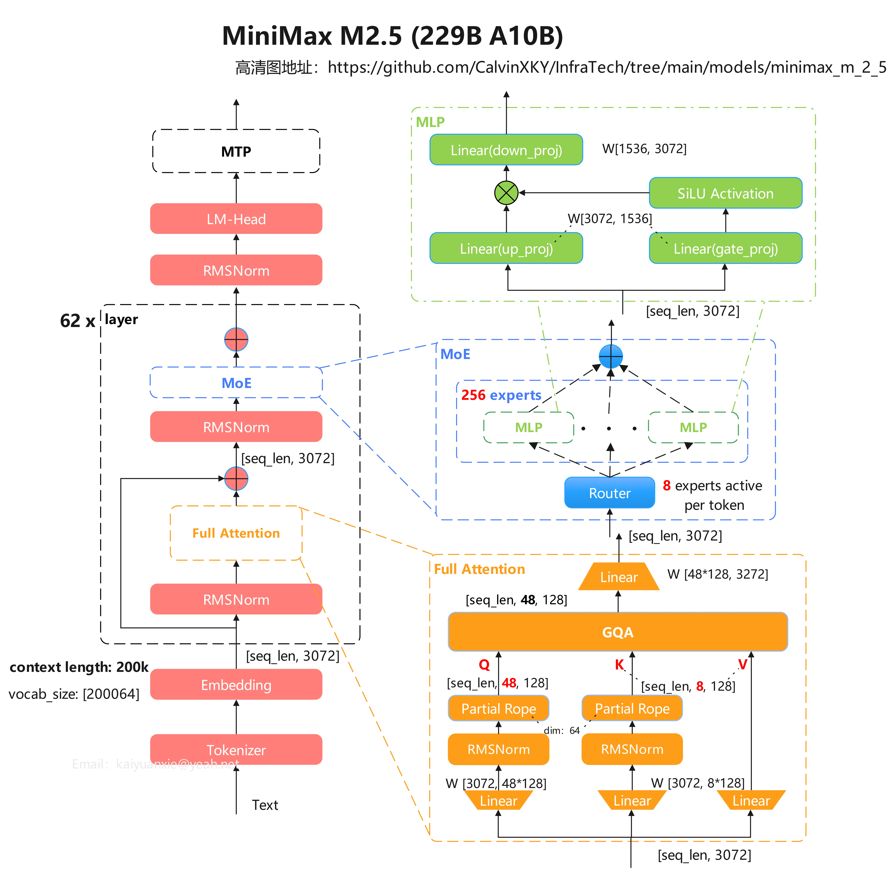

# MiniMax-M2.5模型简介

 MiniMax-M2.5模型采用GAQ+MOE结构，整体参数229B，运行激活参数10B。从M1到M2，MiniMax继续用回了Full Attention格式，M2.5的架构与M2保持一致。

效果：在 SWE-Bench Verified、Multi-SWE-Bench 和 BrowseComp（含上下文管理）等评测中分别取得了 80.2%、51.3% 和 76.3% 的高分。

性能：SWE-Bench Verified评测的速度比M2.1快37%，与Claude Opus 4.6的速度相当。

架构特点：
- Attention模块：
  - 采用partial rope计算位置编码
  - 使用QK RMSNorn
  - GQA模式
- MoE模块，均采用独立专家，单token仅8个专家计算
- 支持序列长度200k

## 整体架构

  

## 相关资料：

- [整体介绍（官方博客）](https://github.com/MiniMax-AI/MiniMax-M2.5)
- [模型配置文件](https://huggingface.co/MiniMaxAI/MiniMax-M2.5/blob/main/config.json)
- [Transformer模型定义](https://github.com/huggingface/transformers/blob/main/src/transformers/models/minimax_m2/modeling_minimax_m2.py)
